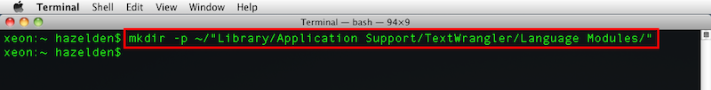

# BBEdit and TextWrangler DigitalSky Codeless Language Module  #
**Version 1.1** Released September 8, 2013  
by Andrew Hazelden

## Overview ##
I would like to present a new BBEdit and TextWrangler syntax highlighting module that works with code from [Sky-Skan's DigitalSky planetarium software](http://www.skyskan.com/products/ds). The new module makes it a lot easier for a planetarium presenter to compose a **DigitalSky** show script using a Mac OS X based system.

**Note:** This syntax highlighting module requires either [TextWrangler (free)](http://www.barebones.com/products/textwrangler/) or [BBEdit](http://www.barebones.com/products/bbedit/) from Bare Bones Software.

## Download ##

The DigitalSky Syntax Highlighter module is a free download.

You can download the latest version here:   
[http://www.andrewhazelden.com/blog/2013/09/digital-sky-syntax-highlighter/](http://www.andrewhazelden.com/blog/2013/09/digital-sky-syntax-highlighter/)

## Installation ##

**Step 1.**  [Download TextWrangler](http://www.barebones.com/products/textwrangler/) and install it on your system. If you own a copy of [BBEdit](http://www.barebones.com/products/bbedit/) you can use it instead. After you install the software, run it once to create the preference folders.

**Step 2.**  Copy the "DigitalSky.plist" file from the **install** folder to your Language Modules folder.

If you are using TextWrangler the module belongs in this folder:
    ~/Library/Application Support/TextWrangler/Language Modules/

If you are using BBEdit the module belongs in this folder:
    ~/Library/Application Support/BBEdit/Language Modules/

If you are on Lion / Mountain Lion you can open the hidden **~/library** folder by switching to the Finder. From the "Go" Menu select, "Go to Folder..." or press the hotkey **Shift-Command-G**.

Paste in the Languages Module folder path and hit "go". 

If you are running Mountain Lion and the BBEdit / TextWrangler "Language Modules" folder doesn't exist you can create the folders manually. A quick way to create the folders is to use the terminal:

TextWrangler Folder Creation Command:  
> mkdir -p ~/"Library/Application Support/TextWrangler/Language Modules/"

BBEdit Folder Creation Command:  
> mkdir -p ~/"Library/Application Support/BBEdit/Language Modules/"

Once you are in the Language Modules folder you can copy the **DigitalSky.plist** file in place.

**Step 3.**  We need to restart TextWrangler for the new language module to be listed in the TextWrangler language popup menu.

If you open a Sky-Skan DigitalSky script at this point you will see plain unformatted text. Let's enable the DigitalSky compatible syntax highlighting module.

Open the **Language** popup menu at the bottom left of the text editor window and select **DigitalSky**. This will turn on syntax highlighting and make it easier to develop complex planetarium show scripts.

**Note:** If the DigitalSky button script is has a name ranging from **f1.txt** to **f96.txt** it is automatically detected as a DigitalSky document by TextWrangler or BBEdit.

Here is an example DigitalSky 2 show script with syntax highlighting enabled:

## Bonus - Download a Color Scheme ##

If you are new to TextWrangler or BBEdit you will probably want to download a color scheme to customize your work environment. I've written two themes to get you started: The [Charcoal Color Scheme](http://www.andrewhazelden.com/blog/2012/09/charcoal-color-scheme-for-textwrangler-and-bbedit/) and the [Midnight Blue Color Scheme](http://www.andrewhazelden.com/blog/2012/06/midnight-blue-color-scheme-for-textwrangler-and-bbedit/).

This is the view with the default color scheme that comes with TextWrangler / BBEdit:  

* * *

This is the view with the [Charcoal Color Scheme](http://www.andrewhazelden.com/blog/2012/09/charcoal-color-scheme-for-textwrangler-and-bbedit/) in action:  

* * *

This is the view with the  [Midnight Blue Color Scheme](http://www.andrewhazelden.com/blog/2012/06/midnight-blue-color-scheme-for-textwrangler-and-bbedit/) in action:  

* * *

I hope this tool makes it easier for presenters and science visualizers to develop fulldome planetarium shows using the excellent TextWrangler text editor on a Mac OS X System.

Cheers,  
Andrew Hazelden

eMail: [andrew@andrewhazelden.com](mailto:andrew@andrewhazelden.com)   
Blog: [http://www.andrewhazelden.com](http://www.andrewhazelden.com)  
Twitter: [@andrewhazelden](https://twitter.com/andrewhazelden)  
Google+: [https://plus.google.com/u/0/105694670378845894137](https://plus.google.com/u/0/105694670378845894137)

