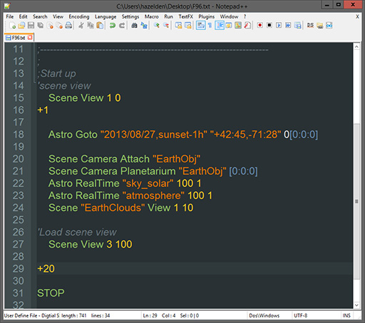
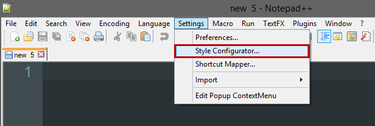
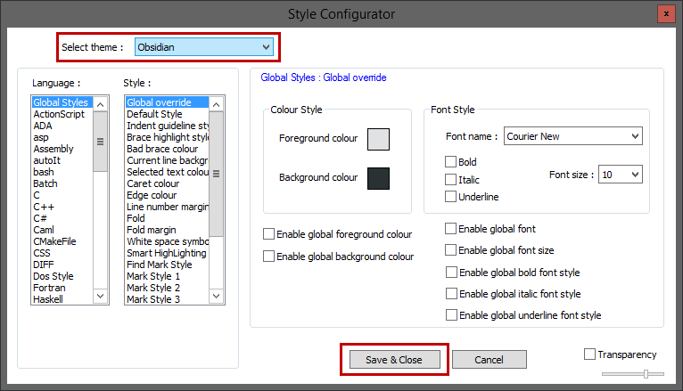
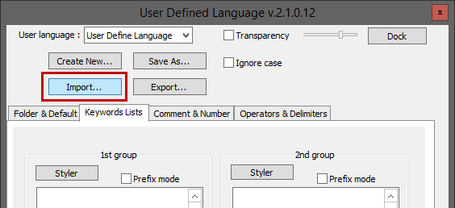
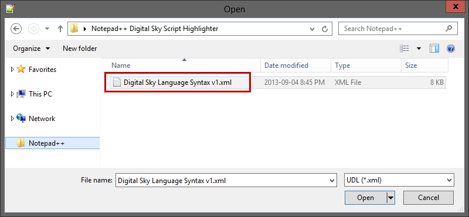
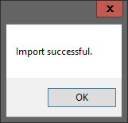
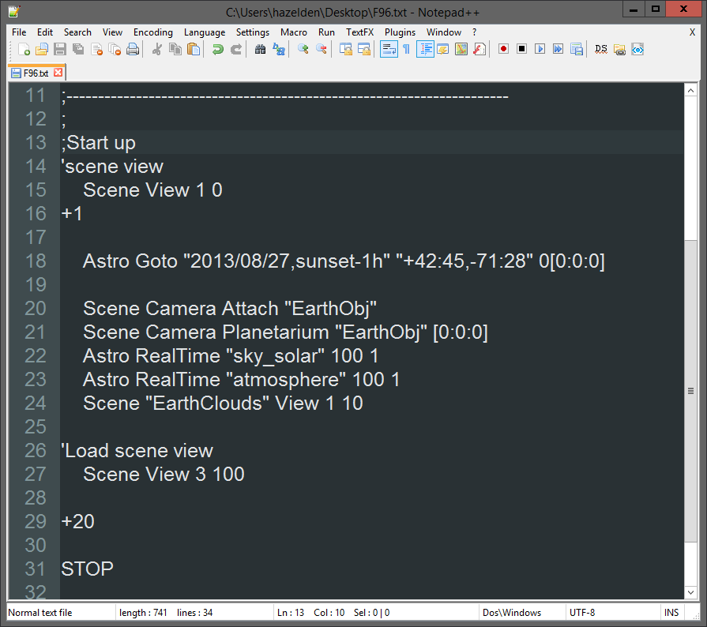
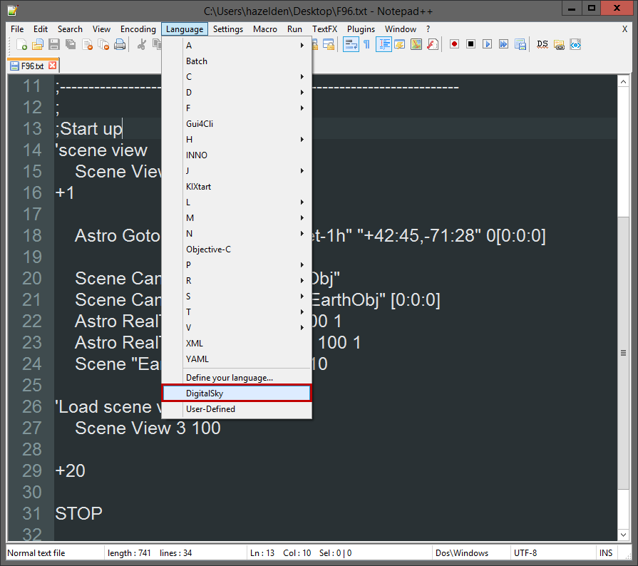

# Notepad++ DigitalSky Syntax Highlighter  #
**Version 1.1** Released September 8, 2013  
by Andrew Hazelden

## Overview ##
I would like to present a new Notepad++ syntax highlighting module that works with code from [Sky-Skan's DigitalSky planetarium software](http://www.skyskan.com/products/ds). The new module makes it easier for a planetarium presenter to compose a **DigitalSky** show script using a full featured external text editor.

**Note:** The free program Notepad++ is required to use the syntax highlighter.

## Download ##

The DigitalSky Syntax Highlighter module is a free download.

You can download the latest version here:   
[http://www.andrewhazelden.com/blog/2013/09/digital-sky-syntax-highlighter/](http://www.andrewhazelden.com/blog/2013/09/digital-sky-syntax-highlighter/)

## Installation ##

**Step 1.**  [Download Notepad++](http://notepad-plus-plus.org/download/v6.4.5.html) and install it on your system. After you start Notepad++ you will see a blank text editing window.

**Step 2.**  The syntax highlighting module has been customized to work with the dark background based **Obsidian** theme. To load the Obsidian theme in Notepad++, go to the **Settings** menu and select **"Style Configurator...**

In the Style Configurator window select the **Obsidian** theme and click the **Save and Close** button. 

**Step 3.** Let's load the custom "DigitalSky" syntax highlighting module. Open the **Language** menu in Notepad++ and select the **Define your language...** menu item. The "User Defined Language" window will load.

**Step 4.** In the "User Defined Language" window, click on the **Import** button to load the XML based language file.

In the open dialog select the "DigitalSky Language Syntax v1.xml" file and click **open**.

If the file was loaded correctly an "Import Successful" notice will appear.  Click the **OK** button to continue. At this point you should close the "User Defined Language" widow by clicking on the window's **X** shaped close button.

**Step 5.**  We need to restart Notepad++ for the new language module to be listed in the Notepad++ language menu.

If you open a Sky-Skan DigitalSky script at this point you will see plain unformatted text. Let's enable the DigitalSky compatible syntax highlighting module.

Open the **Language** menu and select **DigitalSky**. This will turn on syntax highlighting and make it easier to develop complex planetarium show scripts.
 

Here is an example DigitalSky 2 show script with Notepad++ based syntax highlighting enabled:

* * *

I hope this tool makes it easier for presenters and science visualizers to create fulldome planetarium shows using the excellent Notepad++ text editor. 

Cheers,  
Andrew Hazelden

eMail: [andrew@andrewhazelden.com](mailto:andrew@andrewhazelden.com)   
Blog: [http://www.andrewhazelden.com](http://www.andrewhazelden.com)  
Twitter: [@andrewhazelden](https://twitter.com/andrewhazelden)  
Google+: [https://plus.google.com/u/0/105694670378845894137](https://plus.google.com/u/0/105694670378845894137)

