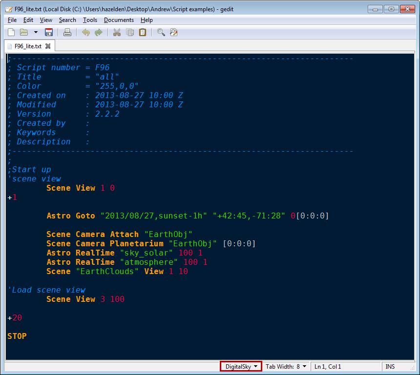
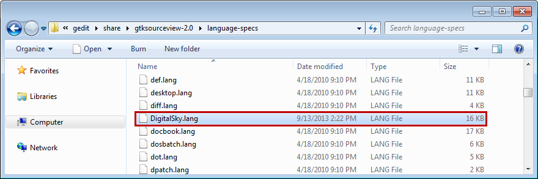
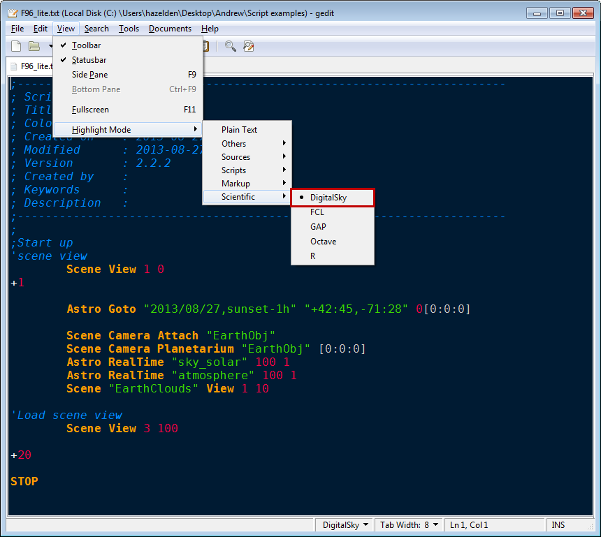
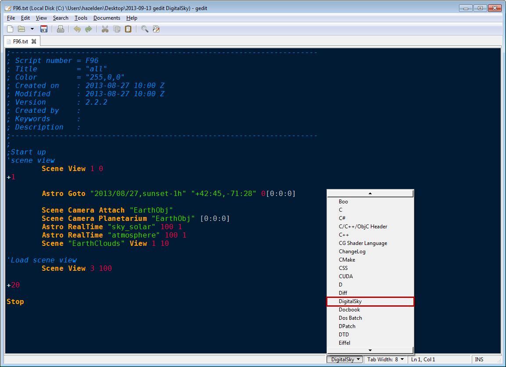

# gedit DigitalSky Syntax Highlighter  #
**Version 1.1** Released September 13, 2013  
by Andrew Hazelden

## Overview ##
I would like to present a new gedit syntax highlighting module that works with code from [Sky-Skan's DigitalSky planetarium software](http://www.skyskan.com/products/ds). The new module makes it easier for a planetarium presenter to compose a **DigitalSky** show script using a full featured external text editor on Linux/Windows/Mac.

**Note:** The free program gedit is required to use this syntax highlighter.

## Download ##

The DigitalSky Syntax Highlighter module is a free download.

You can download the latest version here:   
[http://www.andrewhazelden.com/blog/2013/09/digital-sky-syntax-highlighter/](http://www.andrewhazelden.com/blog/2013/09/digital-sky-syntax-highlighter/)

## Installation ##

**Step 1.**  [Download gedit](https://projects.gnome.org/gedit/) and install it on your system. If you are on Linux you already have a copy of gedit on you system. After you start gedit you will see a blank text editing window.

**Step 2.**  Copy the **DigitalSky.lang** file to your gedit language-specs folder.

On Windows you need to copy the DigitalSky.lang file to the **language-specs** folder located at:
    `C:\Program Files (x86)\gedit\share\gtksourceview-2.0\language-specs\DigitalSky.lang`  
or  
    `C:\Program Files\gedit\share\gtksourceview-2.0\language-specs\DigitalSky.lang`  
  
On Linux you need to copy the DigitalSky.lang file to the language-specs folder located at:
     `/usr/local/share/gtksourceview-2.0/language-specs/DigitalSky.lang`  
or  
     `/usr/share/gtksourceview-2.0/language-specs/DigitalSky.lang`  

     
**Step 3.**  We need to restart gedit for the new language module to be listed in the gedit **Highlighter Mode** menu. Let's check if the script was installed correctly by opening the menu **View > Highlighter Mode > Scientific > Digital Sky**.

If you open a Sky-Skan DigitalSky script at this point you will see plain unformatted text. Let's enable the DigitalSky compatible syntax highlighting module. Open the **Language** menu on the bottom right of the window and select **DigitalSky**. This will turn on syntax highlighting and make it easier to develop complex planetarium show scripts.
 

* * *

I hope this tool makes it easier for presenters and science visualizers to create fulldome planetarium shows using the excellent gedit text editor. 

Cheers,  
Andrew Hazelden

eMail: [andrew@andrewhazelden.com](mailto:andrew@andrewhazelden.com)   
Blog: [http://www.andrewhazelden.com](http://www.andrewhazelden.com)  
Twitter: [@andrewhazelden](https://twitter.com/andrewhazelden)  
Google+: [https://plus.google.com/u/0/105694670378845894137](https://plus.google.com/u/0/105694670378845894137)

