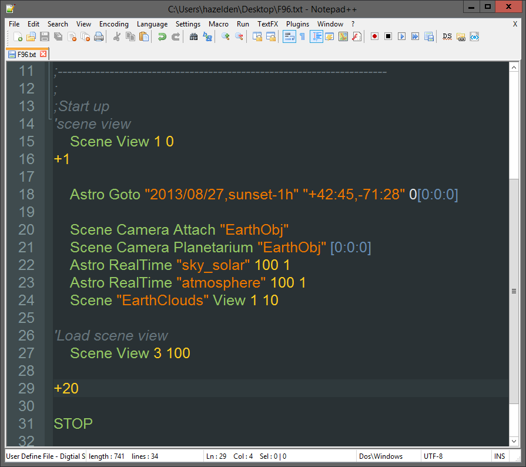

# DigitalSky Syntax Highlighters #
**Version 1** Released September 6, 2013  
by Andrew Hazelden

## Overview ##

I would like to present a new set of Notepad++, gedit, BBEdit, and TextWrangler syntax highlighting modules that work with scripts from [Sky-Skan's DigitalSky planetarium software](http://www.skyskan.com/products/ds). The new modules make it a lot easier for a planetarium presenter to compose a DigitalSky show script on their Mac, Linux, or Windows based personal computers and laptops away from the main DigitalSky system.

* * *

I hope this tool makes it easier for presenters and science visualizers to create fulldome planetarium shows using a plain text editor.

Cheers,  
Andrew Hazelden

eMail: [andrew@andrewhazelden.com](mailto:andrew@andrewhazelden.com)   
Blog: [http://www.andrewhazelden.com](http://www.andrewhazelden.com)  
Twitter: [@andrewhazelden](https://twitter.com/andrewhazelden)  
Google+: [https://plus.google.com/u/0/105694670378845894137](https://plus.google.com/u/0/105694670378845894137)
